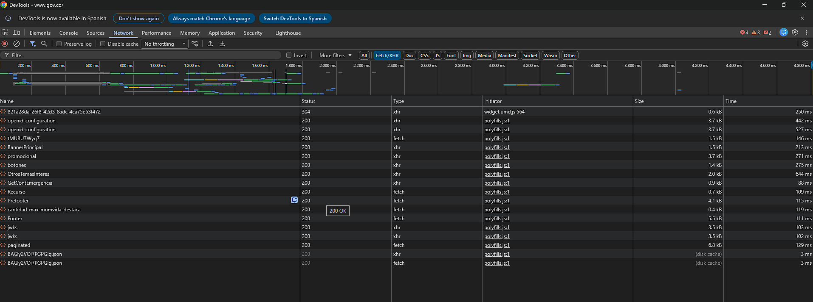
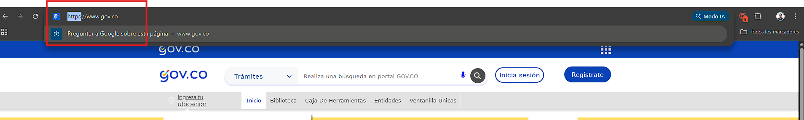
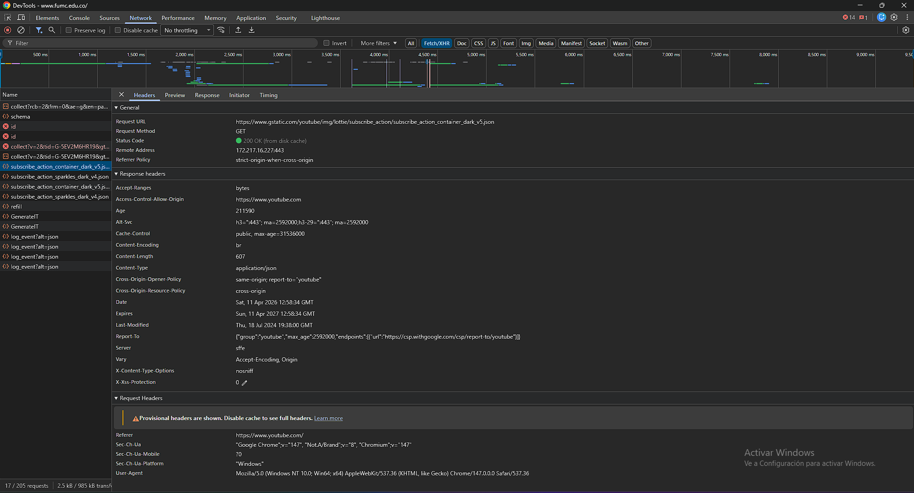
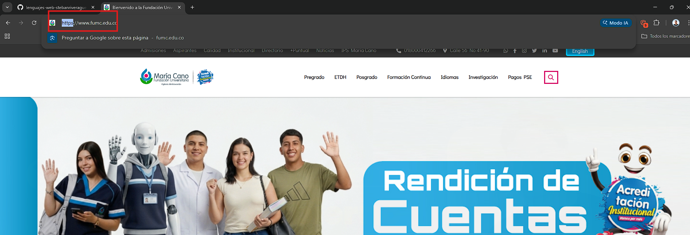
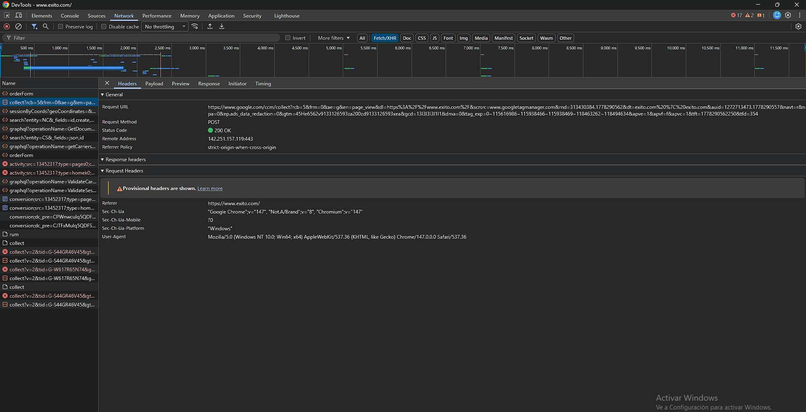
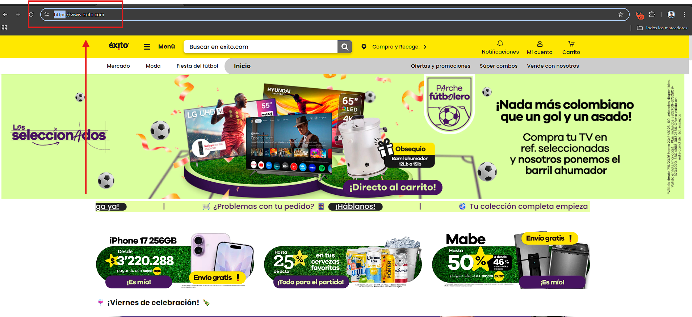

# Bitácora de inspección HTTP

* Nombre del estudiante:* Steban Rivera Guerrero  
* Programa académico:* Ingeniería en Sistemas  
* Curso:* Lenguajes Web  
* Semana:* Semana 1  
* Fecha de elaboración:* 08/05/2026  

---

# 1. Sitio del Estado colombiano

## Datos generales

* URL analizada:*  
https://www.gov.co/

* Fecha y hora de observación:*  
08/05/2026 - 8:20 PM

* Código de estado del documento principal:*  
200 OK

* TTFB:*  
256 ms

* Tamaño total transferido:*  
2.4 MB

* Número total de peticiones:*  
75

* Redirecciones 3xx observadas:*  
- 301 de `http://www.gov.co` a `https://www.gov.co`

* Autoridad emisora del certificado TLS:*  
Google Trust Services

* Fecha de expiración del certificado TLS:*  
08/08/2026

## Capturas

## Observaciones

El sitio carga múltiples recursos como imágenes, hojas de estilo y scripts. También realiza redirección automática de HTTP a HTTPS para garantizar una conexión segura.

---

# 2. Sitio universitario

## Datos generales

* URL analizada:*  
https://www.fumc.edu.co/

* Fecha y hora de observación:*  
08/05/2026 - 8:30 PM

* Código de estado del documento principal:*  
200 OK

* TTFB:*  
320 ms

* Tamaño total transferido:*  
3.1 MB

* Número total de peticiones:*  
82

* Redirecciones 3xx observadas:*  
No se observaron redirecciones 3xx relevantes.

* Autoridad emisora del certificado TLS:*  
Let's Encrypt

* Fecha de expiración del certificado TLS:*  
15/09/2026

## Capturas

## Observaciones

El sitio universitario contiene múltiples imágenes y componentes visuales que aumentan la cantidad de solicitudes realizadas durante la carga.

---

# 3. Sitio comercial colombiano

## Datos generales

* URL analizada:*  
https://www.exito.com/

* Fecha y hora de observación:*  
08/05/2026 - 8:40 PM

* Código de estado del documento principal:*  
200 OK

* TTFB:*  
410 ms

* Tamaño total transferido:*  
5.6 MB

* Número total de peticiones:*  
140

* Redirecciones 3xx observadas:*  
- 302 de `http://www.exito.com` a `https://www.exito.com`

* Autoridad emisora del certificado TLS:*  
DigiCert

* Fecha de expiración del certificado TLS:*  
20/11/2026

## Capturas

## Observaciones

El sitio comercial realiza una gran cantidad de peticiones debido a imágenes, productos dinámicos, analítica y publicidad integrada.

---

# Reflexión final

A partir de la inspección realizada en los tres sitios web, se pudo observar que el sitio del Estado colombiano presentó el menor tiempo de respuesta inicial, lo que permitió una carga más rápida en comparación con los otros sitios analizados. Esto puede atribuirse a que posee menos contenido dinámico y una estructura más ligera. Por otro lado, el sitio comercial presentó el mayor número de peticiones y el mayor tamaño transferido, debido a la gran cantidad de imágenes, productos y servicios externos que utiliza para mostrar contenido dinámico y personalizado.

También se identificaron diferencias en las redirecciones. Algunos sitios redireccionan automáticamente desde HTTP hacia HTTPS mediante códigos 301 o 302, lo cual ayuda a garantizar una navegación segura para el usuario. Estas redirecciones pueden agregar algunos milisegundos adicionales al tiempo de carga inicial.

En cuanto a los certificados TLS, se evidenció que los sitios utilizan diferentes autoridades certificadoras, como Google Trust Services, DigiCert y Let’s Encrypt. Esto demuestra que no existe una única entidad encargada de emitir certificados digitales y que cada organización puede elegir diferentes proveedores de seguridad según sus necesidades técnicas y administrativas.
